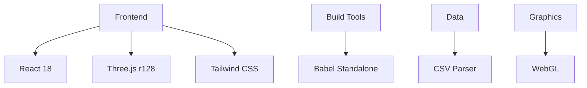

# Interactive 3D Periodic Table

<div align="center">


**An advanced, interactive three-dimensional periodic table application built with React, Three.js, and modern web technologies.**

**The project can be tested live at [periodic-table.tannertunstall.com](https://periodic-table.tannertunstall.com)**

[Features](#features) • [Installation](#installation) • [Usage](#usage-instructions) • [Documentation](#technical-specifications)

</div>

---

## Table of Contents

- [Overview](#overview)
- [Features](#features)
- [Installation](#installation)
- [Usage Instructions](#usage-instructions)
- [Technical Specifications](#technical-specifications)
- [Customization](#customization-options)
- [Known Limitations](#known-limitations-and-technical-constraints)
- [Contributing](#contributing-guidelines)
- [License](#license-information)

---

## Overview

This educational platform provides comprehensive visualization of chemical elements with scientifically accurate atomic models and detailed elemental data. The application combines modern web technologies to deliver an immersive learning experience for chemistry education and scientific reference.

### Key Highlights

- **118 Interactive Elements** with complete periodic table coverage
- **3D Atomic Models** using nuclear shell theory
- **Real-time Electron Animation** with proper orbital mechanics
- **Responsive Design** optimized for all devices
- **Performance Mode** for resource-constrained environments

---

## Features

### Three-Dimensional Atomic Visualization

| Feature | Description |
|---------|-------------|
| **Nuclear Shell Model** | Protons and neutrons positioned according to nuclear shell theory with magic numbers |
| **Electron Shells** | Accurate orbital arrangements following 2, 8, 18, 32 electron capacity patterns |
| **Interactive Controls** | Mouse drag rotation, wheel zoom, real-time orbital animation |
| **Particle Coding** | Color-differentiated protons (red), neutrons (gray), electrons (green) |

### Interactive Periodic Table Interface

```
┌─────────────────────────────────────────────────────────────┐
│  H                                                      He  │
│  Li Be                               B  C  N  O  F     Ne  │
│  Na Mg                               Al Si P  S  Cl    Ar  │
│  K  Ca Sc Ti V  Cr Mn Fe Co Ni Cu Zn Ga Ge As Se Br   Kr  │
│  Rb Sr Y  Zr Nb Mo Tc Ru Rh Pd Ag Cd In Sn Sb Te I    Xe  │
│  Cs Ba La Hf Ta W  Re Os Ir Pt Au Hg Tl Pb Bi Po At   Rn  │
│  Fr Ra Ac Rf Db Sg Bh Hs Mt Ds Rg Cn Nh Fl Mc Lv Ts   Og  │
│                                                             │
│     La Ce Pr Nd Pm Sm Eu Gd Tb Dy Ho Er Tm Yb Lu          │
│     Ac Th Pa U  Np Pu Am Cm Bk Cf Es Fm Md No Lr          │
└─────────────────────────────────────────────────────────────┘
```

- **Standard IUPAC Layout** with proper element positioning
- **Lanthanide/Actinide Series** in dedicated sections
- **Element Classification** with visual color coding
- **Search and Filter** by name, symbol, or atomic number

### Comprehensive Element Database

<details>
<summary><strong>Data Categories</strong></summary>

**Fundamental Properties**
- Atomic mass, period, group, phase
- Electron configuration data

**Physical Characteristics** 
- Density, melting/boiling points
- Atomic radius, electronegativity

**Historical Information**
- Discovery attribution and year
- Isotope enumeration

**Classification Data**
- Metal/nonmetal/metalloid status
- Radioactivity and natural occurrence

</details>

---

## Installation

### Prerequisites

- Modern web browser with WebGL 1.0+ support
- Local HTTP server environment
- Minimum 2GB RAM recommended

### Installation Procedure

1. **Clone Repository**
   ```bash
   git clone https://github.com/yourusername/interactive-3d-periodic-table.git
   cd interactive-3d-periodic-table
   ```

2. **Verify File Structure**
   ```
   project-directory/
   ├── index.html                      # Main application file
   └── Periodic Table of Elements.csv  # Element data source
   ```

3. **Start Local Server**
   
   Choose your preferred method:
   
   ```bash
   # Python 3
   python -m http.server 8000
   
   # Node.js
   npx serve .
   
   # PHP
   php -S localhost:8000
   ```

4. **Access Application**
   ```
   http://localhost:8000
   ```

---

## Usage Instructions

### Navigation Controls

| Action | Method | Description |
|--------|--------|-------------|
| **Element Selection** | Click | Open 3D model and detailed information |
| **Search** | Type in search bar | Filter by name, symbol, or atomic number |
| **Performance Toggle** | Checkbox | Optimize for lower-end devices |
| **Particle Effects** | Checkbox | Enable/disable background animations |

### 3D Model Interaction

```javascript
// Control Scheme
Mouse Drag     → Rotate atomic model
Mouse Wheel    → Zoom in/out  
Click Close    → Return to periodic table
```

### Element Information Modal

Each element provides:

- **3D Atomic Structure** with accurate particle positioning
- **Property Data Tables** organized by category
- **Discovery Information** including historical context
- **Visual Legends** for particle identification

---

## Technical Specifications

### Technology Stack



### Dependencies

| Library | Version | Purpose |
|---------|---------|---------|
| React | 18.x | Component framework |
| Three.js | r128 | 3D graphics rendering |
| Tailwind CSS | Latest | Utility-first styling |
| Babel Standalone | Latest | JSX transformation |
| Inter Font | Latest | Typography |

### Browser Compatibility

| Browser | Support Level | Notes |
|---------|---------------|-------|
| Chrome/Chromium | ✅ Full | Recommended |
| Firefox | ✅ Full | Complete compatibility |
| Safari | ✅ Full | All features supported |
| Edge | ✅ Full | Modern Edge versions |
| Mobile | ⚠️ Limited | Touch optimized, may have performance constraints |

### Performance Metrics

| Device Type | Recommended Settings |
|-------------|---------------------|
| **Desktop** | All features enabled |
| **Laptop** | Standard mode |
| **Tablet** | Performance mode recommended |
| **Mobile** | Performance mode required |

---

## Customization Options

### Element Color Schemes

```javascript
// Modify getElementColor() function
const colors = {
    'Alkali Metal': '#10b981',
    'Alkaline Earth Metal': '#059669', 
    'Transition Metal': '#374151',
    'Lanthanide': '#f59e0b',
    'Actinide': '#dc2626',
    'Noble Gas': '#8b5cf6',
    'Halogen': '#ec4899',
    'Nonmetal': '#ef4444',
    'Metalloid': '#f59e0b',
    'Metal': '#3b82f6'
};
```

### 3D Model Parameters

```javascript
// Adjustable parameters in create3DModel()
const config = {
    nucleusRadius: Math.max(1, Math.pow(totalNucleons, 1/3) * 0.3),
    shellDistance: nucleusRadius + 3 + shell * 2.5,
    particleSize: {
        proton: 0.12,
        neutron: 0.12, 
        electron: 0.1
    },
    animationSpeed: 0.02 / (shell + 1)
};
```

### Performance Optimizations

| Setting | Standard Mode | Performance Mode |
|---------|---------------|------------------|
| **Geometry Detail** | High (32 segments) | Low (16 segments) |
| **Shadows** | Enabled | Disabled |
| **Particle Count** | Unlimited | Limited to 60 |
| **Animation Rate** | 60 FPS | 30 FPS |

---

## Known Limitations and Technical Constraints

### Critical Requirements

> **CORS Restriction**: Must be served via HTTP/HTTPS. Cannot run from `file://` protocol.

> **CSV Dependency**: `Periodic Table of Elements.csv` must be in same directory as `index.html`.

### Performance Considerations

| Issue | Impact | Mitigation |
|-------|--------|------------|
| **High Atomic Numbers** | Rendering slowdown | Performance mode |
| **Mobile Devices** | Limited 3D capability | Touch-optimized UI |
| **Memory Usage** | Gradual increase | Periodic refresh |
| **WebGL Support** | Required for 3D | Graceful fallback needed |

### Data Limitations

- **Historical Accuracy**: Based on provided CSV dataset
- **Isotope Detail**: Shows count only, not individual isotopes  
- **Shell Model**: Simplified educational representation
- **Property Coverage**: Limited to CSV data fields

---

## Contributing Guidelines

We welcome contributions to improve the Interactive 3D Periodic Table. Please consider these areas:

### Priority Enhancement Areas

1. **Additional Element Properties**
   - Extended physical data
   - Chemical reactivity information
   - Industrial applications

2. **Advanced Visualizations**
   - Molecular orbital representations
   - Isotope-specific models
   - Chemical bonding animations

3. **Performance Improvements**
   - WebGL 2.0 implementation
   - Progressive loading
   - Caching mechanisms

4. **Accessibility Features**
   - Screen reader support
   - Keyboard navigation
   - High contrast modes

### Development Workflow

```bash
# 1. Fork the repository
# 2. Create feature branch
git checkout -b feature/your-feature-name

# 3. Make changes and test
# 4. Commit with descriptive message
git commit -m "Add: detailed commit description"

# 5. Push and create pull request
git push origin feature/your-feature-name
```

---


## Attribution and Credits

<table>
<tr>
<td align="center">
<strong>Primary Developer</strong><br>
Tanner Tunstall<br>
<em>Application Architecture & Implementation</em>
</td>
<td align="center">
<strong>AI Assistance</strong><br>
Anthropic's Claude Sonnet 4<br>
<em>Code Review & Documentation</em>
</td>
</tr>
</table>

### External Resources

- [Three.js Documentation](https://threejs.org/docs/) - 3D Graphics Library
- [React Documentation](https://reactjs.org/docs/) - Component Framework  
- [Tailwind CSS](https://tailwindcss.com/) - Styling Framework
- [WebGL Compatibility](https://caniuse.com/webgl) - Browser Support

---

<div align="center">

**Built for scientific education and interactive learning applications**


</div>
